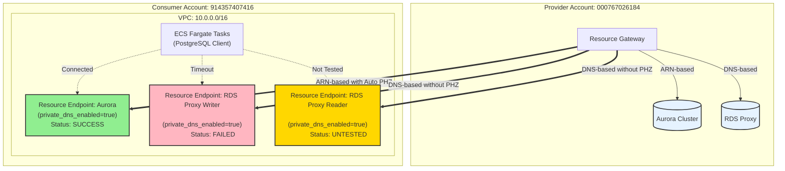

# Pattern A: Resource Endpoint のみを使用したアクセス

## 概要

VPC Lattice Resource Endpointを使用してクロスアカウントのRDS/RDS Proxyにアクセスするパターンです。
Service NetworkやService Network Endpointは使用しません。

## ディレクトリ構成

```
cross-account-rds-pattern-a/
├── README.md                      # このファイル
├── rds-proxy/                     # Provider Account (既存リソースを使用)
│   └── README.md                 # 使用するResource Gatewayと Resource Configurationの情報
└── rds-client/                    # Consumer Account (新規作成)
    ├── vpc.tf                    # VPC、Resource Endpoints
    ├── database_connectivity.tf  # Resource Endpoints for databases
    ├── ecs_test_infrastructure.tf # ECS Cluster、IAM Roles (テスト用)
    ├── provider.tf               # AWS Provider設定
    ├── backend.tf                # Terraform Backend設定
    ├── variables.tf              # 変数定義
    ├── outputs.tf                # 出力定義
    └── Makefile                  # Docker image build, ECS tasks, connectivity tests
```

## アーキテクチャ



## 接続性マトリクス

| リソース | 接続方法 | DNS名 | テスト結果 | データベースIP |
|----------|----------|-------|-----------|--------------|
| Aurora Cluster (Writer) | Resource Endpoint (ARN-based) | `pattern-a-aurora-cluster.cluster-cpo0q8m8sxzx.ap-northeast-1.rds.amazonaws.com` | ✅ **接続成功** | 10.1.2.96 |
| Aurora Cluster (Reader) | Resource Endpoint (ARN-based) | `pattern-a-aurora-cluster.cluster-ro-cpo0q8m8sxzx.ap-northeast-1.rds.amazonaws.com` | 🔄 未テスト | - |
| RDS Proxy Writer | Resource Endpoint (DNS-based) | `pattern-a-rds-proxy.proxy-cpo0q8m8sxzx.ap-northeast-1.rds.amazonaws.com` | ❌ **接続不可（タイムアウト）** | - |
| RDS Proxy Reader | Resource Endpoint (DNS-based) | `pattern-a-rds-proxy-reader.endpoint.proxy-cpo0q8m8sxzx.ap-northeast-1.rds.amazonaws.com` | 🔄 未テスト | - |

### テスト実施日: 2025-11-18

**成功したテスト詳細:**
```
Test 1: Aurora Cluster
- Endpoint: pattern-a-aurora-cluster.cluster-cpo0q8m8sxzx.ap-northeast-1.rds.amazonaws.com
- User: postgres
- DB Server IP: 10.1.2.96
- PostgreSQL Version: 15.10 on x86_64-pc-linux-gnu
- 接続時間: 即座
```

## 重要なポイント

### ✅ 動作するケース
- **Aurora (ARN-based Resource Configuration)**:
  - ARN-basedのResource Configurationは自動的にPrivate Hosted Zoneを作成
  - 標準DNS名（`*.rds.amazonaws.com`）で接続可能

### ❌ 動作しないケース
- **RDS Proxy (DNS-based Resource Configuration)**:
  - DNS-basedのResource ConfigurationはPrivate Hosted Zoneを作成しない
  - 標準DNS名での接続は不可
  - Lattice DNS名もなし（Service Networkを使用していないため）

## デプロイ手順

### 1. Provider Account のリソース確認

既存のResource GatewayとResource Configurationを使用します。
`cross-account-rds-arn-based-resource-config/rds-proxy` を参照してください。

### 2. Consumer Account のデプロイ

```bash
cd cross-account-rds-pattern-a/rds-client
aws-vault exec rds-client -- terraform init
aws-vault exec rds-client -- terraform plan
aws-vault exec rds-client -- terraform apply
```

### 3. テスト用Dockerイメージのビルド

**重要**: AWS Fargate (X86_64) で動作するDockerイメージを作成する必要があります。
M1/M2 Mac では `--platform` フラグが正しく動作しないため、digest-based pullを使用します。

```bash
cd cross-account-rds-pattern-a/rds-client

# Makefileを使用してamd64イメージをビルド・プッシュ
make docker-build

# タスク定義を登録
make ecs-register
```

**詳細**: Makefileに全ての手順が含まれています。`make help` で利用可能なコマンドを確認できます。

### 4. 接続テストの実行

#### オプション1: Makefileを使用した自動テスト

```bash
# テスト環境のセットアップ（イメージビルド、タスク定義登録、タスク起動）
make setup

# 全ての接続テストを実行
make test-all
```

#### オプション2: CloudWatch Logsで結果を確認する方法

```bash
# テストタスクを起動（全エンドポイントをテスト）
aws-vault exec rds-client -- aws ecs run-task \
  --cluster pattern-a-test-cluster \
  --task-definition pattern-a-postgres-test:6 \
  --launch-type FARGATE \
  --network-configuration "awsvpcConfiguration={subnets=[...],securityGroups=[...],assignPublicIp=DISABLED}"

# CloudWatch Logsでテスト結果を確認
aws-vault exec rds-client -- aws logs tail /ecs/pattern-a-postgres-test --follow
```

**テスト結果の例:**
```
=== VPC Lattice Pattern A - Database Connectivity Test ===
開始時刻: Tue Nov 18 08:56:37 AM UTC 2025

[Test 1] Aurora Cluster (ARN-based Resource Configuration with Private Hosted Zone)
Endpoint: pattern-a-aurora-cluster.cluster-cpo0q8m8sxzx.ap-northeast-1.rds.amazonaws.com
       test_name        | current_user | db_server_ip |                      version
------------------------+--------------+--------------+--------------------------------
 Test 1: Aurora Cluster | postgres     | 10.1.2.96    | PostgreSQL 15.10 on x86_64-pc-linux-gnu
(1 row)

[Test 2] RDS Proxy Writer (DNS-based Resource Configuration)
Endpoint: pattern-a-rds-proxy.proxy-cpo0q8m8sxzx.ap-northeast-1.rds.amazonaws.com
(タイムアウト - 接続不可)
```

## トラブルシューティング

### Docker Architecture Issues (M1/M2 Mac)

**問題**: ECSタスクが `[FATAL tini] exec docker-entrypoint.sh failed: Exec format error` で失敗する

**原因**: M1/M2 Mac で `docker pull --platform linux/amd64` が正しく動作せず、arm64イメージがプッシュされている

**解決策**: 必ず **digest-based pull** を使用する（Makefileに実装済み）
```bash
# ❌ 動作しない方法
docker pull --platform linux/amd64 postgres:15

# ✅ 正しい方法（Makefileで実装）
AMD64_DIGEST=$(docker manifest inspect postgres:15 | jq -r '.manifests[] | select(.platform.architecture=="amd64") | .digest')
docker pull postgres@$AMD64_DIGEST
docker image inspect ... --format '{{.Architecture}}'  # 必ず amd64 を確認
```

詳細は `/Users/mizzy/src/github.com/mizzy/playground/CLAUDE.md` の「Docker and ECS Fargate Best Practices」セクションを参照。

### ECS Exec Not Working

**問題**: `TargetNotConnectedException` でECS Execが使えない

**原因**: プライベートサブネットのタスクがSSM endpointsに到達できない

**必要なVPCエンドポイント**:
- `com.amazonaws.ap-northeast-1.ssmmessages`
- `com.amazonaws.ap-northeast-1.ssm`
- `com.amazonaws.ap-northeast-1.ec2messages`

**代替策**: テスト用タスク定義（revision 6）を使用してCloudWatch Logsでテスト結果を確認

## クリーンアップ

```bash
cd cross-account-rds-pattern-a/rds-client

# ECSタスクを停止
make ecs-stop

# Terraformリソースを削除
aws-vault exec rds-client -- terraform destroy
```

## 制限事項と今後の課題

### 確認済みの制限事項

1. ✅ **Aurora Cluster (ARN-based)**: 正常に動作
   - Private Hosted Zoneが自動作成される
   - 標準DNS名（`*.rds.amazonaws.com`）で接続可能

2. ❌ **RDS Proxy (DNS-based)**: 動作しない
   - Private Hosted Zoneが作成されない
   - DNS解決またはルーティングの問題
   - タイムアウトで接続不可

3. ⚠️ **ECS Exec**: プライベートサブネットでは追加設定が必要
   - SSM VPCエンドポイントが必要
   - または CloudWatch Logsでテスト結果を確認

### 今後の調査項目

1. **RDS Proxy接続失敗の原因特定**:
   - DNS-based Resource Configurationの設定確認
   - Resource EndpointのDNS解決テスト
   - VPC Latticeのルーティング検証

2. **代替パターンの検証**:
   - Pattern B: Service Network + Service Network Endpoint
   - Pattern C: その他のアプローチ

3. **SSM VPCエンドポイントの追加**:
   - ECS Execを有効化するためのインフラ追加
