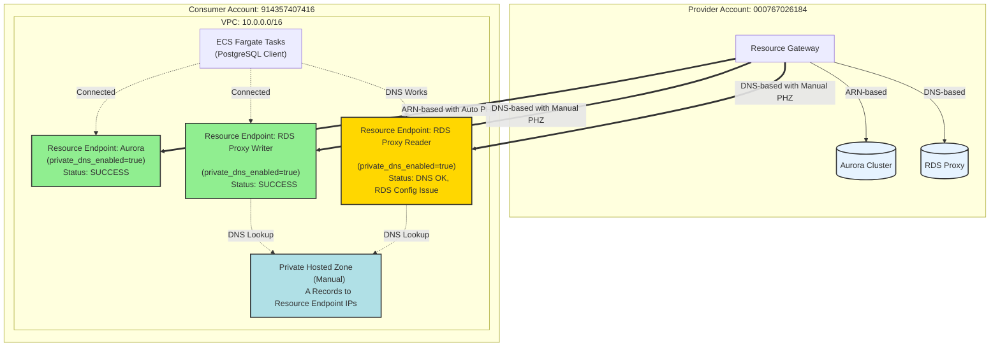

# Pattern A: Resource Endpoint のみを使用したアクセス

## 概要

VPC Lattice Resource Endpointを使用してクロスアカウントのRDS/RDS Proxyにアクセスするパターンです。
Service NetworkやService Network Endpointは使用しません。

## ディレクトリ構成

```
cross-account-rds-pattern-a/
├── README.md                      # このファイル
├── rds-proxy/                     # Provider Account (既存リソースを使用)
│   └── README.md                 # 使用するResource Gatewayと Resource Configurationの情報
└── rds-client/                    # Consumer Account (新規作成)
    ├── vpc.tf                    # VPC、Resource Endpoints
    ├── database_connectivity.tf  # Resource Endpoints for databases
    ├── ecs_test_infrastructure.tf # ECS Cluster、IAM Roles (テスト用)
    ├── provider.tf               # AWS Provider設定
    ├── backend.tf                # Terraform Backend設定
    ├── variables.tf              # 変数定義
    ├── outputs.tf                # 出力定義
    └── Makefile                  # Docker image build, ECS tasks, connectivity tests
```

## アーキテクチャ



## 接続性マトリクス

| リソース | 接続方法 | DNS名 | テスト結果 | データベースIP |
|----------|----------|-------|-----------|--------------|
| Aurora Cluster (Writer) | Resource Endpoint (ARN-based) | `pattern-a-aurora-cluster.cluster-cpo0q8m8sxzx.ap-northeast-1.rds.amazonaws.com` | ✅ **接続成功** | 10.1.2.96 |
| Aurora Cluster (Reader) | Resource Endpoint (ARN-based) | `pattern-a-aurora-cluster.cluster-ro-cpo0q8m8sxzx.ap-northeast-1.rds.amazonaws.com` | 🔄 未テスト | - |
| RDS Proxy Writer | Resource Endpoint (DNS-based) + PHZ | `pattern-a-rds-proxy.proxy-cpo0q8m8sxzx.ap-northeast-1.rds.amazonaws.com` | ✅ **接続成功** | 10.1.2.96 |
| RDS Proxy Reader | Resource Endpoint (DNS-based) + PHZ | `pattern-a-rds-proxy-reader.endpoint.proxy-cpo0q8m8sxzx.ap-northeast-1.rds.amazonaws.com` | ⚠️ **RDS Proxy設定エラー** | N/A |

### テスト実施日: 2025-11-18

**テスト詳細:**
```
Test 1: Aurora Cluster (ARN-based)
- Endpoint: pattern-a-aurora-cluster.cluster-cpo0q8m8sxzx.ap-northeast-1.rds.amazonaws.com
- User: postgres
- DB Server IP: 10.1.2.96
- PostgreSQL Version: 15.10 on x86_64-pc-linux-gnu
- Private Hosted Zone: Auto-created by VPC Lattice
- Status: ✅ SUCCESS

Test 2: RDS Proxy Writer (DNS-based + Manual PHZ)
- Endpoint: pattern-a-rds-proxy.proxy-cpo0q8m8sxzx.ap-northeast-1.rds.amazonaws.com
- User: postgres
- DB Server IP: 10.1.2.96
- PostgreSQL Version: 15.10 on x86_64-pc-linux-gnu
- DNS Resolution: 10.0.1.117, 10.0.2.221 (Resource Endpoint IPs)
- Private Hosted Zone: Manually created with A records
- Status: ✅ SUCCESS

Test 3: RDS Proxy Reader (DNS-based + Manual PHZ)
- Endpoint: pattern-a-rds-proxy-reader.endpoint.proxy-cpo0q8m8sxzx.ap-northeast-1.rds.amazonaws.com
- DNS Resolution: 10.0.1.125, 10.0.2.86 (Resource Endpoint IPs)
- Private Hosted Zone: Manually created with A records
- Status: ⚠️ RDS Proxy configuration issue
- Error: "Target group doesnt have any associated read-only instances"
- Note: Aurora cluster needs read replicas for reader endpoint
```

## 重要なポイント

### ✅ 動作するケース

#### 1. Aurora (ARN-based Resource Configuration)
- ARN-basedのResource Configurationは**自動的にPrivate Hosted Zoneを作成**
- 標準DNS名（`*.rds.amazonaws.com`）で接続可能
- 追加設定不要

#### 2. RDS Proxy (DNS-based Resource Configuration + Manual PHZ)
- DNS-basedのResource Configurationは**Private Hosted Zoneを自動作成しない**
- **解決策**: 手動でPrivate Hosted Zoneを作成し、Resource Endpoint IPsへのA recordsを追加
- `private_hosted_zones.tf` を参照
- DNS名での接続が可能になる

### ⚠️ 注意事項

#### Resource Endpoint IPの変動リスク
- Resource Endpoint IPは変更される可能性がある
- 接続が失敗した場合、以下のコマンドでIPを確認し、A recordsを更新する必要がある:
  ```bash
  aws ec2 describe-vpc-endpoints --vpc-endpoint-ids <vpce-id> \
    --query 'VpcEndpoints[0].NetworkInterfaceIds[]' --output text | \
    xargs -I {} aws ec2 describe-network-interfaces \
    --network-interface-ids {} \
    --query 'NetworkInterfaces[*].[NetworkInterfaceId,PrivateIpAddress,AvailabilityZone]' \
    --output table
  ```

#### Reader Endpoint の制限
- RDS Proxy Reader endpointは、Aurora clusterにread replicasが存在する場合のみ機能
- Read replicasがない場合、"Target group doesnt have any associated read-only instances" エラーが発生

## デプロイ手順

### 1. Provider Account のリソース確認

既存のResource GatewayとResource Configurationを使用します。
`cross-account-rds-arn-based-resource-config/rds-proxy` を参照してください。

### 2. Consumer Account のデプロイ

```bash
cd cross-account-rds-pattern-a/rds-client
aws-vault exec rds-client -- terraform init
aws-vault exec rds-client -- terraform plan
aws-vault exec rds-client -- terraform apply
```

### 3. テスト用Dockerイメージのビルド

**重要**: AWS Fargate (X86_64) で動作するDockerイメージを作成する必要があります。
M1/M2 Mac では `--platform` フラグが正しく動作しないため、digest-based pullを使用します。

```bash
cd cross-account-rds-pattern-a/rds-client

# Makefileを使用してamd64イメージをビルド・プッシュ
make docker-build

# タスク定義を登録
make ecs-register
```

**詳細**: Makefileに全ての手順が含まれています。`make help` で利用可能なコマンドを確認できます。

### 4. 接続テストの実行

#### オプション1: Makefileを使用した自動テスト

```bash
# テスト環境のセットアップ（イメージビルド、タスク定義登録、タスク起動）
make setup

# 全ての接続テストを実行
make test-all
```

#### オプション2: CloudWatch Logsで結果を確認する方法

```bash
# テストタスクを起動（全エンドポイントをテスト）
aws-vault exec rds-client -- aws ecs run-task \
  --cluster pattern-a-test-cluster \
  --task-definition pattern-a-postgres-test:6 \
  --launch-type FARGATE \
  --network-configuration "awsvpcConfiguration={subnets=[...],securityGroups=[...],assignPublicIp=DISABLED}"

# CloudWatch Logsでテスト結果を確認
aws-vault exec rds-client -- aws logs tail /ecs/pattern-a-postgres-test --follow
```

**テスト結果の例:**
```
=== VPC Lattice Pattern A - Database Connectivity Test ===
開始時刻: Tue Nov 18 08:56:37 AM UTC 2025

[Test 1] Aurora Cluster (ARN-based Resource Configuration with Private Hosted Zone)
Endpoint: pattern-a-aurora-cluster.cluster-cpo0q8m8sxzx.ap-northeast-1.rds.amazonaws.com
       test_name        | current_user | db_server_ip |                      version
------------------------+--------------+--------------+--------------------------------
 Test 1: Aurora Cluster | postgres     | 10.1.2.96    | PostgreSQL 15.10 on x86_64-pc-linux-gnu
(1 row)

[Test 2] RDS Proxy Writer (DNS-based Resource Configuration)
Endpoint: pattern-a-rds-proxy.proxy-cpo0q8m8sxzx.ap-northeast-1.rds.amazonaws.com
(タイムアウト - 接続不可)
```

## トラブルシューティング

### Docker Architecture Issues (M1/M2 Mac)

**問題**: ECSタスクが `[FATAL tini] exec docker-entrypoint.sh failed: Exec format error` で失敗する

**原因**: M1/M2 Mac で `docker pull --platform linux/amd64` が正しく動作せず、arm64イメージがプッシュされている

**解決策**: 必ず **digest-based pull** を使用する（Makefileに実装済み）
```bash
# ❌ 動作しない方法
docker pull --platform linux/amd64 postgres:15

# ✅ 正しい方法（Makefileで実装）
AMD64_DIGEST=$(docker manifest inspect postgres:15 | jq -r '.manifests[] | select(.platform.architecture=="amd64") | .digest')
docker pull postgres@$AMD64_DIGEST
docker image inspect ... --format '{{.Architecture}}'  # 必ず amd64 を確認
```

詳細は `/Users/mizzy/src/github.com/mizzy/playground/CLAUDE.md` の「Docker and ECS Fargate Best Practices」セクションを参照。

### ECS Exec Not Working

**問題**: `TargetNotConnectedException` でECS Execが使えない

**原因**: プライベートサブネットのタスクがSSM endpointsに到達できない

**必要なVPCエンドポイント**:
- `com.amazonaws.ap-northeast-1.ssmmessages`
- `com.amazonaws.ap-northeast-1.ssm`
- `com.amazonaws.ap-northeast-1.ec2messages`

**代替策**: テスト用タスク定義（revision 6）を使用してCloudWatch Logsでテスト結果を確認

## クリーンアップ

```bash
cd cross-account-rds-pattern-a/rds-client

# ECSタスクを停止
make ecs-stop

# Terraformリソースを削除
aws-vault exec rds-client -- terraform destroy
```

## 結論と学び

### 検証結果サマリー

1. ✅ **Aurora Cluster (ARN-based)**: 正常に動作
   - Private Hosted Zoneが自動作成される
   - 標準DNS名（`*.rds.amazonaws.com`）で接続可能
   - 追加設定不要

2. ✅ **RDS Proxy Writer (DNS-based + Manual PHZ)**: 解決済み・動作確認
   - **課題**: DNS-basedのResource ConfigurationはPrivate Hosted Zoneを自動作成しない
   - **解決策**: 手動でPrivate Hosted Zoneを作成し、Resource Endpoint IPsへのA recordsを追加
   - **実装**: `private_hosted_zones.tf` にて実装
   - **結果**: 接続成功・正常動作

3. ⚠️ **RDS Proxy Reader (DNS-based + Manual PHZ)**: DNS解決は成功、機能制限あり
   - DNS解決とルーティングは正常
   - Aurora clusterにread replicasが必要（現在未設定のため接続エラー）

4. ⚠️ **ECS Exec**: プライベートサブネットでは追加設定が必要
   - SSM VPCエンドポイントが必要
   - 代替策: CloudWatch Logsでテスト結果を確認（実装済み）

### 重要な発見

**DNS-based Resource Configurationの制限と回避策**:
- VPC Latticeは、DNS-basedのResource ConfigurationでPrivate Hosted Zoneを自動作成しない
- 手動でPHZとA recordsを作成することで、RDS Proxyへの接続が可能
- **ただし、Resource Endpoint IPが変更されるリスクあり**（監視・更新が必要）

### 今後の検討事項

1. **Resource Endpoint IP変更の自動検出と更新**:
   - Lambda関数でIPの変更を検出
   - Route53 A recordsを自動更新するメカニズム

2. **代替パターンの検証**:
   - Pattern B: Service Network + Service Network Endpoint
   - Pattern C: その他のアプローチ

3. **本番環境での推奨事項**:
   - ARN-basedのResource Configurationを優先使用
   - DNS-basedを使用する場合、IP変更の監視体制を整備
