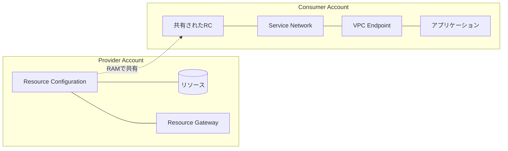
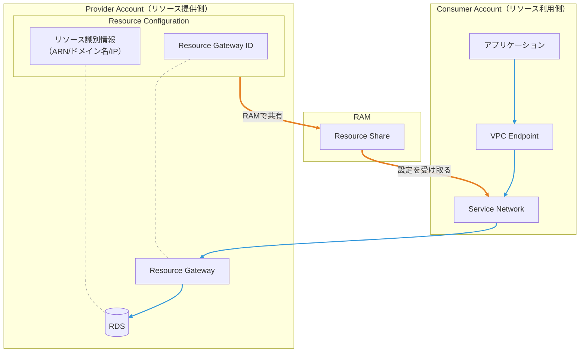

# AWS RAM と VPC Lattice によるクロスアカウントRDSアクセス

## 目次

1. [AWS RAMとは](#1-aws-ramとは)
2. [VPC Latticeとは](#2-vpc-latticeとは)
3. [実践例：クロスアカウントRDSアクセス](#3-実践例クロスアカウントrdsアクセス)
4. [Terraformによる実装](#4-terraformによる実装)
5. [Terraformでの注意点](#5-terraformでの注意点)

---

## 1. AWS RAMとは

### 1.1 概要

**AWS Resource Access Manager (RAM)** は、AWSリソースを複数のAWSアカウント間で共有するためのサービスです。

### 1.2 共有可能なリソース例

- VPCサブネット
- Transit Gateway
- Route 53 Resolver ルール
- License Manager ライセンス設定
- VPC Lattice Resource Configuration

参考: [共有可能な AWS リソース](https://docs.aws.amazon.com/ja_jp/ram/latest/userguide/shareable.html)

### 1.3 Resource Shareの構成要素

リソースを共有するには、Resource Shareを作成します。Resource Shareは「何を」「誰に」共有するかを定義します。


#### Provider側

| 構成要素 | 役割 | Terraformリソース |
|---------|------|-------------------|
| **Resource Share** | 共有の入れ物 | `aws_ram_resource_share` |
| **Resource Association** | 共有するリソース | `aws_ram_resource_association` |
| **Principal Association** | 共有先 | `aws_ram_principal_association` |

#### Consumer側

| 構成要素 | 役割 | Terraformリソース |
|---------|------|-------------------|
| **Resource Share Accepter** | 共有の承諾 | `aws_ram_resource_share_accepter` |

※ 同一Organization内で、RAMコンソール → 設定 →「AWS Organizationsとの共有を有効にする」を設定している場合は承諾不要

### 1.4 リソースタイプごとの共有範囲

RAMで共有できるリソースには、**組織外にも共有可能なもの**と、**組織内のみ共有可能なもの**があります。

| 共有範囲 | リソース例 |
|---------|-----------|
| **組織外にも共有可能** | VPC Lattice（Service Network、Service、Resource Configuration）、Aurora DBクラスター、Transit Gateway、Prefix List |
| **組織内のみ共有可能** | VPCサブネット、Security Group、Outposts、AWS Cloud Map Namespace |

※ 組織内のみ共有可能なリソースは、管理アカウントのRAMコンソール → 設定 →「AWS Organizationsとの共有を有効にする」が必要

参考: [共有可能な AWS リソース](https://docs.aws.amazon.com/ja_jp/ram/latest/userguide/shareable.html)

---

## 2. VPC Latticeとは

### 2.1 概要

**Amazon VPC Lattice** は、VPCやアカウントを跨いだ通信を実現するネットワーキングサービスです。

### 2.2 主要コンポーネント

VPC Latticeには主に2つのパターンがあります。

| パターン | 用途 | 主な構成要素 |
|---------|------|-------------|
| **Service + Target Group** | HTTP/HTTPS/gRPCサービスの公開 | Service、Target Group、Listener |
| **Resource Gateway + Resource Configuration** | TCP/UDPリソース（RDS等）へのアクセス | Resource Gateway、Resource Configuration |

RDSはTCPリソースのため、後者のパターンにフォーカスします。

### 2.3 接続パターン

Resource Gateway + Resource Configurationパターンには複数の接続方法があります。

| パターン | IPアドレス | 元のDNS名で接続                                                |
|---------|-----------|----------------------------------------------------------|
| **Service Network VPC Association** | Link-local (169.254.171.0/24) | 非対応（Lattice DNS名を使用）                                     |
| **Service Network VPC Endpoint** | VPC CIDR（ENI作成） | ARN-basedは対応、DNS-basedは最近対応したようだが※未検証なのと、現時点でTerraform未対応 |
| **Resource VPC Endpoint** | VPC CIDR（ENI作成） | ARN-basedは対応、DNS-basedは最近対応したようだが※未検証なのと、現時点でTerraform未対応 |

※ [Amazon VPC Lattice がリソース構成向けにカスタムドメイン名のサポートを開始 - AWS](https://aws.amazon.com/jp/about-aws/whats-new/2025/11/amazon-vpc-lattice-custom-domain-name-resource-configuration/)

### 2.4 Service Network VPC Endpointパターンの構成要素

以下はService Network VPC Endpointパターンの構成要素です。



#### Provider側

| 構成要素 | 役割 | Terraformリソース |
|---------|------|-------------------|
| **Resource Gateway** | リソースへのトラフィックを受け入れる入口 | `aws_vpclattice_resource_gateway` |
| **Resource Configuration** | Resource Gateway経由でアクセスするリソースの定義 | `aws_vpclattice_resource_configuration` |

#### Consumer側

| 構成要素 | 役割 | Terraformリソース |
|---------|------|-------------------|
| **VPC Endpoint** | Service NetworkをConsumer VPCに接続 | `aws_vpc_endpoint` |
| **Service Network** | 共有されたResource Configurationを束ねる論理ネットワーク | `aws_vpclattice_service_network` |
| **Service Network Resource Association** | Resource ConfigurationとService Networkの関連付け | `aws_vpclattice_service_network_resource_association` |

※ この図は設定時の関連を示しています。通信の流れは「3. 実践例」で詳しく説明します。

---

## 3. 実践例：クロスアカウントRDSアクセス

### 3.1 構成と実行時のフロー

接続パターンは **Service Network VPC Endpoint** を採用しています。



- <span style="color:#e67e22">**オレンジ線**</span>: 構成時にRAMで共有される接続設定
- <span style="color:#999">**グレー点線**</span>: Resource Configurationが参照する情報
- <span style="color:#3498db">**青線**</span>: 通信の流れ

**ポイント**: Consumer AccountのService Networkは、RAMで共有されたResource Configurationの情報をもとに、トラフィックをどこに送ればいいか（Resource Gateway）を知ることができます。

#### 各構成要素の役割

| 構成要素 | 配置 | 役割 |
|---------|------|------|
| **Resource Gateway** | Provider | RDSなどへのトラフィックを受け入れる入口 |
| **Resource Configuration** | Provider | アクセス対象のリソースとResource Gatewayの紐付けを定義 |
| **RAM Resource Share** | - | Resource Configurationを別アカウントに共有するための仕組み |
| **Service Network** | Consumer | 共有されたResource Configurationを束ねる論理的なネットワーク |
| **VPC Endpoint** | Consumer | Service NetworkをConsumer VPCに接続するエンドポイント |

---

## 4. Terraformによる実装

### 4.1 Provider Account側の設定

#### Resource GatewayとResource Configurationの作成

```hcl
# Resource Gateway の作成
resource "aws_vpclattice_resource_gateway" "main" {
  name               = "rds-resource-gateway"
  vpc_id             = aws_vpc.main.id
  subnet_ids         = [aws_subnet.private_a.id, aws_subnet.private_c.id]
  security_group_ids = [aws_security_group.rds.id]
}

# Resource Configuration の作成（ARN指定）
resource "aws_vpclattice_resource_configuration" "rds_cluster" {
  name                        = "aurora-resource-config"
  resource_gateway_identifier = aws_vpclattice_resource_gateway.main.id
  type                        = "ARN"

  resource_configuration_definition {
    arn_resource {
      arn = aws_rds_cluster.main.arn
    }
  }
}
```

#### RAM Resource Shareの設定

```hcl
# RAM Resource Share の作成
resource "aws_ram_resource_share" "resource_config" {
  name                      = "rds-cross-account-share"
  allow_external_principals = true  # 組織外への共有を許可

  tags = {
    Name = "rds-cross-account-share"
  }
}

# Resource Configuration を Resource Share に関連付け
resource "aws_ram_resource_association" "rds_cluster" {
  resource_arn       = aws_vpclattice_resource_configuration.rds_cluster.arn
  resource_share_arn = aws_ram_resource_share.resource_config.arn
}

# 共有先アカウントの指定
resource "aws_ram_principal_association" "rds_client" {
  principal          = "123456789012"  # Consumer Account ID
  resource_share_arn = aws_ram_resource_share.resource_config.arn
}
```

### 4.2 Consumer Account側の設定

#### RAM Resource Shareの承諾

```hcl
# RAM Resource Share を承諾
resource "aws_ram_resource_share_accepter" "resource_config" {
  share_arn = "arn:aws:ram:ap-northeast-1:123456789012:resource-share/xxxxxxxx-xxxx-xxxx-xxxx-xxxxxxxxxxxx"
}
```

#### Service NetworkとVPC Endpointの作成

```hcl
# Service Network の作成
resource "aws_vpclattice_service_network" "main" {
  name      = "rds-service-network"
  auth_type = "NONE"
}

# VPC Endpoint で Service Network に接続
resource "aws_vpc_endpoint" "service_network" {
  vpc_id              = aws_vpc.main.id
  service_network_arn = aws_vpclattice_service_network.main.arn
  vpc_endpoint_type   = "ServiceNetwork"
  subnet_ids          = [aws_subnet.private_a.id, aws_subnet.private_c.id]
  security_group_ids  = [aws_security_group.database.id]
  private_dns_enabled = true  # RDSエンドポイント名でアクセス可能にする
}

# 共有された Resource Configuration を Service Network に関連付け
resource "aws_vpclattice_service_network_resource_association" "aurora" {
  resource_configuration_identifier = "rcfg-xxxxxxxxxxxxxxxx"
  service_network_identifier        = aws_vpclattice_service_network.main.id

  # RAM Share の承諾が完了してから作成
  depends_on = [aws_ram_resource_share_accepter.resource_config]
}
```

---

## 5. Terraformでの注意点

### 5.1 適用順序

Provider側で Resource Share を作成しないと `share_arn` が確定しないため、Consumer側の `aws_ram_resource_share_accepter` を設定できません。

```
1. Provider側: terraform apply（Resource Share作成）
2. share_arn を Consumer側のコードに反映
3. Consumer側: terraform apply
```

### 5.2 Resource Share Invitationの有効期限

Resource Share Invitationには有効期限があります。Provider側で `terraform apply` した後、有効期限内にConsumer側で `terraform apply`（または手動accept）を完了する必要があります。

期限切れ後はConsumer側で承諾できなくなるため、Provider側で再度招待を送る必要があります。

| 有効期限 | 対象リソースタイプ |
|---------|-------------------|
| **7日間** | Aurora DBクラスター、EC2（Capacity Reservations、Dedicated Hosts）、License Manager、Outposts、Route 53 Forwarding Rules、VPC（サブネット、Transit Gateway等） |
| **12時間** | 上記以外のリソースタイプ（VPC Lattice Resource Configuration含む） |

招待を再作成した場合、`share_arn` が変わる可能性があります（公式ドキュメントには明記されていません）。変わった場合はConsumer側のコードも更新が必要になります。

参考: [リソース共有への招待の承諾と拒否](https://docs.aws.amazon.com/ja_jp/ram/latest/userguide/working-with-shared-invitations.html)

### 5.3 share_arnの受け渡し

`share_arn` はacceptするまでConsumer側からは見えないため、Provider/Consumer間での受け渡しを完全に自動化することは難しいです。

`resource_configuration_identifier` はaccept後にVPC Latticeコンソールや `aws vpc-lattice list-resource-configurations` で確認できます。ただし、Terraformには `data.aws_vpclattice_resource_configuration` データソースが存在しないため、Terraform内で動的に取得することはできません。

無理に自動化せず、Resource Shareのacceptや`resource_configuration_identifier`の反映は手動で行う運用が現実的です。

```bash
# 招待一覧を確認してARNを取得
INVITATION_ARN=$(aws ram get-resource-share-invitations \
  --query 'resourceShareInvitations[0].resourceShareInvitationArn' \
  --output text)

# 招待を承諾
aws ram accept-resource-share-invitation \
  --resource-share-invitation-arn "$INVITATION_ARN"

# accept後、共有されたリソース（Resource Configuration ID等）を確認
aws ram list-resources --resource-owner OTHER-ACCOUNTS
```
