# Pattern B: Service Network + ServiceNetwork VPC Endpoint を使用したアクセス

## 概要

VPC Lattice Service Network と ServiceNetwork VPC Endpoint を使用してクロスアカウントの RDS/RDS Proxy にアクセスするパターンです。
Pattern A (Resource Endpoint 直接接続) とは異なり、Service Network 経由で複数の Resource Configuration に一元的に接続します。

## ディレクトリ構成

```
cross-account-rds-pattern-b/
├── README.md                      # このファイル
├── rds-proxy/                     # Provider Account
│   ├── aurora_cluster.tf         # Aurora PostgreSQL Cluster
│   ├── rds_proxy.tf              # RDS Proxy
│   ├── resource_gateway.tf       # Resource Gateway
│   ├── rds_proxy_resource_config.tf  # Resource Configurations (RDS Proxy Writer/Reader)
│   ├── ram.tf                    # RAM Resource Share
│   ├── vpc.tf                    # VPC (10.1.0.0/16)
│   ├── provider.tf               # AWS Provider設定
│   ├── outputs.tf                # 出力定義
│   └── secrets.tf                # Secrets Manager
└── rds-client/                    # Consumer Account
    ├── service_network.tf        # Service Network, ServiceNetwork VPC Endpoint, Resource Associations
    ├── database_connectivity.tf  # Security Group
    ├── network.tf                # VPC (10.0.0.0/16)
    ├── ecs_test_infrastructure.tf # ECS Cluster、IAM Roles (テスト用)
    ├── provider.tf               # AWS Provider設定
    ├── variables.tf              # 変数定義
    ├── outputs.tf                # 出力定義
    ├── task-def-rds-proxy-test.json  # ECS Task Definition (テスト用)
    ├── run-test.sh               # テスト実行スクリプト
    └── Makefile                  # Docker image build, ECS tasks (将来追加予定)
```

## アーキテクチャ

```mermaid
graph TB
    subgraph Provider["Provider Account: 000767026184"]
        RG[Resource Gateway<br/>rgw-0c0856f9cf8c56faf]

        subgraph AuroraResources["Aurora Resources"]
            Aurora[("Aurora Cluster<br/>pattern-b-aurora-cluster")]
            AuroraWriter["Writer Endpoint<br/>pattern-b-aurora-cluster.cluster-*.rds.amazonaws.com"]
            AuroraReader["Reader Endpoint<br/>pattern-b-aurora-cluster.cluster-ro-*.rds.amazonaws.com"]
        end

        subgraph ProxyResources["RDS Proxy Resources"]
            Proxy[("RDS Proxy<br/>pattern-b-rds-proxy")]
            ProxyWriter["Writer Endpoint<br/>pattern-b-rds-proxy.proxy-*.rds.amazonaws.com"]
            ProxyReader["Reader Endpoint<br/>pattern-b-rds-proxy-reader.endpoint.proxy-*.rds.amazonaws.com"]
        end

        subgraph ResourceConfigs["Resource Configurations"]
            RC_Aurora["Aurora RC<br/>rcfg-08e1a8d1a3efa6a53<br/>(ARN Type)"]
            RC_Aurora_Writer["Aurora Writer Child RC<br/>rcfg-0163a0e6fcb9eb1f7<br/>(CHILD Type)"]
            RC_Aurora_Reader["Aurora Reader Child RC<br/>rcfg-092a6e19eb1ded941<br/>(CHILD Type)"]
            RC_Proxy_Writer["RDS Proxy Writer RC<br/>rcfg-0c7d315913a607ec8<br/>(SINGLE Type)"]
            RC_Proxy_Reader["RDS Proxy Reader RC<br/>rcfg-0cbd0d535853a7bf6<br/>(SINGLE Type)"]
        end

        Aurora --> AuroraWriter
        Aurora --> AuroraReader
        Proxy --> ProxyWriter
        Proxy --> ProxyReader

        RG -.->|ARN-based| RC_Aurora
        RC_Aurora -.->|Auto-generated| RC_Aurora_Writer
        RC_Aurora -.->|Auto-generated| RC_Aurora_Reader
        RG -.->|DNS-based| RC_Proxy_Writer
        RG -.->|DNS-based| RC_Proxy_Reader

        RC_Aurora_Writer -.->|Maps to| AuroraWriter
        RC_Aurora_Reader -.->|Maps to| AuroraReader
        RC_Proxy_Writer -.->|Maps to| ProxyWriter
        RC_Proxy_Reader -.->|Maps to| ProxyReader
    end

    RAM[("RAM Resource Share<br/>Shares Resource Configurations")]
    RC_Aurora -.->|Shared via| RAM
    RC_Proxy_Writer -.->|Shared via| RAM
    RC_Proxy_Reader -.->|Shared via| RAM

    subgraph Consumer["Consumer Account: 914357407416"]
        subgraph VPC["VPC: 10.0.0.0/16"]
            SN["Service Network<br/>sn-0661a3458d26c703c<br/>pattern-b-service-network"]
            SNVPCE["ServiceNetwork VPC Endpoint<br/>vpce-011a293f4ab94273c<br/>private_dns_enabled=true"]

            subgraph Associations["Service Network Resource Associations"]
                SNRA_Aurora["Aurora Association<br/>snra-0a698b88fa3f0fe19"]
                SNRA_Writer["RDS Proxy Writer Association<br/>snra-0229aff74bb448e6b"]
                SNRA_Reader["RDS Proxy Reader Association<br/>snra-0544cdb1809be9bd7"]
            end

            ECS["ECS Fargate Tasks<br/>(PostgreSQL Client)"]

            SNVPCE -->|Connects to| SN
            SN --> SNRA_Aurora
            SN --> SNRA_Writer
            SN --> SNRA_Reader

            ECS -->|DNS Query| SNVPCE
        end
    end

    RAM -.->|Accepts| SNRA_Aurora
    RAM -.->|Accepts| SNRA_Writer
    RAM -.->|Accepts| SNRA_Reader

    SNRA_Aurora ==>|VPC Lattice| RG
    SNRA_Writer ==>|VPC Lattice| RG
    SNRA_Reader ==>|VPC Lattice| RG

    style SNVPCE fill:#90EE90,stroke:#333,stroke-width:2px
    style SN fill:#87CEEB,stroke:#333,stroke-width:2px
    style SNRA_Aurora fill:#FFE4B5,stroke:#333,stroke-width:2px
    style SNRA_Writer fill:#FFE4B5,stroke:#333,stroke-width:2px
    style SNRA_Reader fill:#FFE4B5,stroke:#333,stroke-width:2px
    style RG fill:#DDA0DD,stroke:#333,stroke-width:2px
    style Aurora fill:#E6F3FF,stroke:#333,stroke-width:2px
    style Proxy fill:#E6F3FF,stroke:#333,stroke-width:2px
    style ECS fill:#98FB98,stroke:#333,stroke-width:2px
```



## Pattern A との違い

| 項目 | Pattern A | Pattern B |
|------|-----------|-----------|
| **接続方式** | Resource Endpoint 直接接続 | Service Network 経由接続 |
| **VPC Endpoint タイプ** | `Resource` (各 RC ごと) | `ServiceNetwork` (1個のみ) |
| **VPC Endpoint 数** | 3個 (Aurora, RDS Proxy Writer, Reader) | 1個 (ServiceNetwork VPC Endpoint) |
| **Service Network** | 使用しない | 使用する |
| **Resource Association** | 不要 | 必要 (3個) |
| **スケーラビリティ** | RC 追加ごとに VPC Endpoint 追加 | Service Network に Association 追加のみ |
| **管理コスト** | VPC Endpoint を複数管理 | VPC Endpoint 1個 + Association 管理 |
| **柔軟性** | リソースごとに個別設定可能 | Service Network で一元管理 |

## DNS 名前解決の仕組み

Pattern B では、ServiceNetwork VPC Endpoint の `private_dns_enabled = true` により、以下のように DNS 名前解決が行われます:

1. **ECS タスクが DNS クエリを発行** (例: `pattern-b-rds-proxy.proxy-cpo0q8m8sxzx.ap-northeast-1.rds.amazonaws.com`)
2. **VPC DNS Resolver** (10.0.0.2) が ServiceNetwork VPC Endpoint にクエリを転送
3. **ServiceNetwork VPC Endpoint** が Resource Configuration の `dnsResource.domainName` または `customDomainName` とマッチング
4. **Service Network Resource Association** を通じて適切な Resource Configuration を特定
5. **VPC Lattice** が Resource Gateway 経由でトラフィックをルーティング
6. **Resource Gateway** が rds-proxy アカウントの実際のエンドポイントに接続

### Resource Configuration と Custom Domain Name

**RDS Proxy (SINGLE タイプ):**
- Terraform で `dns_resource.domain_name` のみ指定
- `customDomainName: null` (API レスポンス)
- 実際の DNS 名前解決では `dnsResource.domainName` が使用される

**Aurora (ARN タイプ + CHILD タイプ):**
- 親 RC (ARN タイプ): Aurora クラスター ARN を指定
- AWS が自動的に CHILD タイプの RC を生成
- CHILD RC には `customDomainName` が自動設定される (例: `pattern-b-aurora-cluster.cluster-cpo0q8m8sxzx.ap-northeast-1.rds.amazonaws.com`)

## 接続性マトリクス

| リソース | 接続方法 | DNS名 | テスト結果 | 備考 |
|----------|----------|-------|-----------|------|
| Aurora Cluster (Writer) | Service Network | `pattern-b-aurora-cluster.cluster-cpo0q8m8sxzx.ap-northeast-1.rds.amazonaws.com` | ✅ **接続成功** | CHILD RC の customDomainName で解決 |
| Aurora Cluster (Reader) | Service Network | `pattern-b-aurora-cluster.cluster-ro-cpo0q8m8sxzx.ap-northeast-1.rds.amazonaws.com` | ✅ **接続成功** | CHILD RC の customDomainName で解決 |
| RDS Proxy Writer | Service Network | `pattern-b-rds-proxy.proxy-cpo0q8m8sxzx.ap-northeast-1.rds.amazonaws.com` | ✅ **接続成功** | dnsResource.domainName で解決 |
| RDS Proxy Reader | Service Network | `pattern-b-rds-proxy-reader.endpoint.proxy-cpo0q8m8sxzx.ap-northeast-1.rds.amazonaws.com` | ✅ **接続成功** | dnsResource.domainName で解決 |

### テスト実施日: 2025-11-19

**テスト詳細:**
```
=== VPC Lattice Pattern B - Database Connection Test ===
Start time: 2025-11-19 ...

[DNS Test] Aurora Writer endpoint
pattern-b-aurora-cluster.cluster-cpo0q8m8sxzx.ap-northeast-1.rds.amazonaws.com
✅ DNS lookup successful

[DNS Test] Aurora Reader endpoint
pattern-b-aurora-cluster.cluster-ro-cpo0q8m8sxzx.ap-northeast-1.rds.amazonaws.com
✅ DNS lookup successful

[DNS Test] RDS Proxy Writer endpoint
pattern-b-rds-proxy.proxy-cpo0q8m8sxzx.ap-northeast-1.rds.amazonaws.com
✅ DNS lookup successful

[DNS Test] RDS Proxy Reader endpoint
pattern-b-rds-proxy-reader.endpoint.proxy-cpo0q8m8sxzx.ap-northeast-1.rds.amazonaws.com
✅ DNS lookup successful

[Connection Test] Aurora Writer
✅ Connection successful
endpoint      | current_user | db_ip      | version
--------------+--------------+------------+---------------------------
Aurora Writer | postgres     | 10.1.x.x   | PostgreSQL 15.10 ...

[Connection Test] Aurora Reader
✅ Connection successful

[Connection Test] RDS Proxy Writer
✅ Connection successful

[Connection Test] RDS Proxy Reader
✅ Connection successful
```

## デプロイ手順

### 前提条件

- AWS CLI と aws-vault がインストール済み
- Terraform がインストール済み
- Provider Account (000767026184) と Consumer Account (914357407416) の AWS 認証情報が設定済み

### 1. Provider Account のデプロイ

```bash
cd cross-account-rds-pattern-b/rds-proxy
aws-vault exec rds-proxy -- terraform init
aws-vault exec rds-proxy -- terraform plan
aws-vault exec rds-proxy -- terraform apply
```

デプロイ後、以下の出力値をメモします:
- `aurora_resource_config_arn`
- `rds_proxy_writer_resource_config_arn`
- `rds_proxy_reader_resource_config_arn`

### 2. Consumer Account の変数設定

`rds-client/terraform.tfvars` を作成し、Provider Account の出力値を設定します:

```hcl
aurora_resource_config_arn = "arn:aws:vpc-lattice:ap-northeast-1:000767026184:resourceconfiguration/rcfg-..."
rds_proxy_writer_resource_config_arn = "arn:aws:vpc-lattice:ap-northeast-1:000767026184:resourceconfiguration/rcfg-..."
rds_proxy_reader_resource_config_arn = "arn:aws:vpc-lattice:ap-northeast-1:000767026184:resourceconfiguration/rcfg-..."
```

### 3. Consumer Account のデプロイ

```bash
cd cross-account-rds-pattern-b/rds-client
aws-vault exec rds-client -- terraform init
aws-vault exec rds-client -- terraform plan
aws-vault exec rds-client -- terraform apply
```

### 4. 接続テストの実行

#### CloudWatch Logs でテスト結果を確認する方法

```bash
# テストタスクを起動
./run-test.sh

# 別のターミナルで CloudWatch Logs を確認
aws-vault exec rds-client -- aws logs tail /ecs/pattern-b-postgres-test --follow --since 3m
```

## 重要なポイント

### ✅ ServiceNetwork VPC Endpoint の利点

1. **一元管理**: 1つの VPC Endpoint で複数の Resource Configuration に接続
2. **スケーラビリティ**: Resource Configuration を追加する場合、Service Network Resource Association を追加するだけ
3. **コスト最適化**: VPC Endpoint 1個の料金のみ（Pattern A は3個分の料金）
4. **管理の簡素化**: VPC Endpoint の管理対象が減少

### ⚠️ 注意事項

#### Service Network Resource Association の Provider バグ

Terraform AWS Provider には、Service Network Resource Association で ARN と ID の不整合が発生するバグがあります:

**症状**:
```
Provider produced inconsistent result after apply
resource_configuration_identifier: was cty.StringVal("arn:aws:..."), but now cty.StringVal("rcfg-...")
```

**回避策**:
1. リソースを state から削除: `terraform state rm aws_vpclattice_service_network_resource_association.xxx`
2. 既存の Association を import: `terraform import aws_vpclattice_service_network_resource_association.xxx snra-xxx`

#### Private DNS の自動設定

ServiceNetwork VPC Endpoint に `private_dns_enabled = true` を設定することで、Service Network に関連付けられた全ての Resource Configuration の DNS 名が自動的に解決されます。Pattern A のように個別の Private Hosted Zone を作成する必要はありません。

## トラブルシューティング

### Service Network Resource Association が作成できない

**問題**: `ConflictException: Association already exists`

**原因**: 同じ Service Network と Resource Configuration の組み合わせで既に Association が存在する

**解決策**:
```bash
# 既存の Association を確認
aws-vault exec rds-client -- aws vpc-lattice list-service-network-resource-associations \
  --service-network-identifier sn-xxx

# Terraform に import
aws-vault exec rds-client -- terraform import \
  aws_vpclattice_service_network_resource_association.xxx snra-xxx
```

### DNS 名前解決が失敗する

**問題**: `getent hosts` で DNS 解決できない

**確認項目**:
1. ServiceNetwork VPC Endpoint が作成されているか
2. `private_dns_enabled = true` が設定されているか
3. VPC の DNS サポートと DNS ホスト名が有効か
4. Service Network Resource Association が正常に作成されているか

**確認コマンド**:
```bash
# VPC Endpoint 確認
aws-vault exec rds-client -- aws ec2 describe-vpc-endpoints \
  --vpc-endpoint-ids vpce-xxx

# Service Network Resource Association 確認
aws-vault exec rds-client -- aws vpc-lattice list-service-network-resource-associations \
  --service-network-identifier sn-xxx
```

## クリーンアップ

**重要**: 削除は Consumer Account → Provider Account の順番で行います。

### 1. Consumer Account のリソース削除

```bash
cd cross-account-rds-pattern-b/rds-client
aws-vault exec rds-client -- terraform destroy
```

### 2. Provider Account のリソース削除

```bash
cd cross-account-rds-pattern-b/rds-proxy
aws-vault exec rds-proxy -- terraform destroy
```

## 結論と学び

### 検証結果サマリー

1. ✅ **Service Network + ServiceNetwork VPC Endpoint**: 完全に動作
   - 1つの VPC Endpoint で複数の Resource Configuration に接続可能
   - Private DNS が自動的に全エンドポイントを解決
   - Pattern A よりも管理が簡素化される

2. ✅ **Aurora Cluster (ARN-based)**: 正常に動作
   - AWS が自動的に CHILD タイプの Resource Configuration を生成
   - `customDomainName` が自動設定される
   - Writer/Reader 両方のエンドポイントが利用可能

3. ✅ **RDS Proxy (DNS-based)**: 正常に動作
   - `dnsResource.domainName` による DNS 名前解決
   - Writer/Reader 両方のエンドポイントが利用可能

### Pattern B の利点

1. **スケーラビリティ**: Resource Configuration を追加する場合、Service Network Resource Association を追加するだけ
2. **コスト最適化**: VPC Endpoint 1個の料金（Pattern A は複数個）
3. **管理の簡素化**: VPC Endpoint を個別に管理する必要がない
4. **一元管理**: Service Network で全ての Resource Configuration を管理

### Pattern B の制約

1. **Terraform Provider バグ**: Resource Configuration Association の ARN/ID 不整合問題
2. **Import が必要**: 既存の Association がある場合は import が必要
3. **Service Network の追加コスト**: Service Network 自体に料金が発生する可能性

### 今後の検討事項

1. **パフォーマンス比較**: Pattern A との性能比較
2. **コスト比較**: VPC Endpoint 複数 vs Service Network + VPC Endpoint 1個
3. **マルチアカウント展開**: 複数の Consumer Account での利用パターン
