# Pattern C: Service Network + VPC Association を使用したアクセス

## 概要

VPC Lattice Service Network と **Service Network VPC Association** を使用してクロスアカウントの RDS/RDS Proxy にアクセスするパターンです。
Pattern A (Resource Endpoint 直接接続) や Pattern B (ServiceNetwork VPC Endpoint) とは異なり、VPC Association を使用して Service Network に接続します。

**Pattern B との主な違い**:
- **Pattern B**: ServiceNetwork VPC Endpoint を使用（Private DNS が有効化され、元の DNS 名で接続可能）
- **Pattern C**: Service Network VPC Association を使用（VPC Lattice が生成する DNS 名で接続）

Pattern C では、DNS-based Resource Configuration (RDS Proxy) でも Private Hosted Zone なしで接続できる点が特徴です。

## ディレクトリ構成

```
cross-account-rds-pattern-c/
├── README.md                      # このファイル
├── rds-proxy/                     # Provider Account
│   ├── aurora_cluster.tf         # Aurora PostgreSQL Cluster
│   ├── rds_proxy.tf              # RDS Proxy
│   ├── resource_gateway.tf       # Resource Gateway
│   ├── rds_proxy_resource_config.tf  # Resource Configurations (RDS Proxy Writer/Reader)
│   ├── ram.tf                    # RAM Resource Share
│   ├── vpc.tf                    # VPC (10.1.0.0/16)
│   ├── provider.tf               # AWS Provider設定
│   ├── outputs.tf                # 出力定義
│   └── secrets.tf                # Secrets Manager
└── rds-client/                    # Consumer Account
    ├── service_network.tf        # Service Network, VPC Association, Resource Associations
    ├── database_connectivity.tf  # Security Group
    ├── network.tf                # VPC (10.0.0.0/16)
    ├── ecs_test_infrastructure.tf # ECS Cluster、IAM Roles (テスト用)
    ├── provider.tf               # AWS Provider設定
    ├── variables.tf              # 変数定義
    ├── outputs.tf                # 出力定義
    ├── test-lattice-dns.sh       # RDS Proxy テストスクリプト (VPC Lattice DNS 使用)
    ├── test-aurora-lattice.sh    # Aurora テストスクリプト (VPC Lattice DNS 使用)
    └── Makefile                  # Docker image build, push
```

## アーキテクチャ

```mermaid
graph TB
    subgraph Provider["Provider Account: 000767026184"]
        RG[Resource Gateway<br/>rgw-0c0856f9cf8c56faf]

        subgraph AuroraResources["Aurora Resources"]
            Aurora[("Aurora Cluster<br/>pattern-c-aurora-cluster")]
            AuroraWriter["Writer Endpoint<br/>pattern-c-aurora-cluster.cluster-*.rds.amazonaws.com"]
            AuroraReader["Reader Endpoint<br/>pattern-c-aurora-cluster.cluster-ro-*.rds.amazonaws.com"]
        end

        subgraph ProxyResources["RDS Proxy Resources"]
            Proxy[("RDS Proxy<br/>pattern-c-rds-proxy")]
            ProxyWriter["Writer Endpoint<br/>pattern-c-rds-proxy.proxy-*.rds.amazonaws.com"]
            ProxyReader["Reader Endpoint<br/>pattern-c-rds-proxy-reader.endpoint.proxy-*.rds.amazonaws.com"]
        end

        subgraph ResourceConfigs["Resource Configurations"]
            RC_Aurora["Aurora RC<br/>rcfg-08e1a8d1a3efa6a53<br/>(ARN Type)"]
            RC_Aurora_Writer["Aurora Writer Child RC<br/>rcfg-0163a0e6fcb9eb1f7<br/>(CHILD Type)"]
            RC_Aurora_Reader["Aurora Reader Child RC<br/>rcfg-092a6e19eb1ded941<br/>(CHILD Type)"]
            RC_Proxy_Writer["RDS Proxy Writer RC<br/>rcfg-0c7d315913a607ec8<br/>(SINGLE Type)"]
            RC_Proxy_Reader["RDS Proxy Reader RC<br/>rcfg-0cbd0d535853a7bf6<br/>(SINGLE Type)"]
        end

        Aurora --> AuroraWriter
        Aurora --> AuroraReader
        Proxy --> ProxyWriter
        Proxy --> ProxyReader

        RG -.->|ARN-based| RC_Aurora
        RC_Aurora -.->|Auto-generated| RC_Aurora_Writer
        RC_Aurora -.->|Auto-generated| RC_Aurora_Reader
        RG -.->|DNS-based| RC_Proxy_Writer
        RG -.->|DNS-based| RC_Proxy_Reader

        RC_Aurora_Writer -.->|Maps to| AuroraWriter
        RC_Aurora_Reader -.->|Maps to| AuroraReader
        RC_Proxy_Writer -.->|Maps to| ProxyWriter
        RC_Proxy_Reader -.->|Maps to| ProxyReader
    end

    RAM[("RAM Resource Share<br/>Shares Resource Configurations")]
    RC_Aurora -.->|Shared via| RAM
    RC_Proxy_Writer -.->|Shared via| RAM
    RC_Proxy_Reader -.->|Shared via| RAM

    subgraph Consumer["Consumer Account: 914357407416"]
        subgraph VPC["VPC: 10.0.0.0/16"]
            SN["Service Network<br/>sn-0661a3458d26c703c<br/>pattern-c-service-network"]
            SNVPCA["Service Network VPC Association<br/>snva-xxx<br/>(VPC Associationアプローチ)"]

            subgraph Associations["Service Network Resource Associations"]
                SNRA_Aurora["Aurora Association<br/>snra-0a698b88fa3f0fe19"]
                SNRA_Writer["RDS Proxy Writer Association<br/>snra-0229aff74bb448e6b"]
                SNRA_Reader["RDS Proxy Reader Association<br/>snra-0544cdb1809be9bd7"]
            end

            ECS["ECS Fargate Tasks<br/>(PostgreSQL Client)"]

            SNVPCA -->|Connects to| SN
            SN --> SNRA_Aurora
            SN --> SNRA_Writer
            SN --> SNRA_Reader

            ECS -->|VPC Lattice DNS Query| SNVPCA
        end
    end

    RAM -.->|Accepts| SNRA_Aurora
    RAM -.->|Accepts| SNRA_Writer
    RAM -.->|Accepts| SNRA_Reader

    SNRA_Aurora ==>|VPC Lattice| RG
    SNRA_Writer ==>|VPC Lattice| RG
    SNRA_Reader ==>|VPC Lattice| RG

    style SNVPCA fill:#90EE90,stroke:#333,stroke-width:2px
    style SN fill:#87CEEB,stroke:#333,stroke-width:2px
    style SNRA_Aurora fill:#FFE4B5,stroke:#333,stroke-width:2px
    style SNRA_Writer fill:#FFE4B5,stroke:#333,stroke-width:2px
    style SNRA_Reader fill:#FFE4B5,stroke:#333,stroke-width:2px
    style RG fill:#DDA0DD,stroke:#333,stroke-width:2px
    style Aurora fill:#E6F3FF,stroke:#333,stroke-width:2px
    style Proxy fill:#E6F3FF,stroke:#333,stroke-width:2px
    style ECS fill:#98FB98,stroke:#333,stroke-width:2px
```



## Pattern A/B との違い

| 項目 | Pattern A | Pattern B | Pattern C |
|------|-----------|-----------|-----------|
| **接続方式** | Resource Endpoint 直接接続 | Service Network + VPC Endpoint | Service Network + VPC Association |
| **VPC Endpoint タイプ** | `Resource` (各 RC ごと) | `ServiceNetwork` | なし |
| **VPC Endpoint 数** | 3個 (Aurora, RDS Proxy Writer, Reader) | 1個 | 0個 |
| **VPC Association** | なし | なし | あり |
| **Service Network** | 使用しない | 使用する | 使用する |
| **Resource Association** | 不要 | 必要 (3個) | 必要 (3個) |
| **DNS 名** | 元の DNS 名 | 元の DNS 名 | VPC Lattice DNS 名 |
| **Private Hosted Zone** | 各 RC ごと作成 | Service Network で自動作成 | 不要 |
| **スケーラビリティ** | RC 追加ごとに VPC Endpoint 追加 | Service Network に Association 追加のみ | Service Network に Association 追加のみ |
| **管理コスト** | VPC Endpoint を複数管理 | VPC Endpoint 1個 + Association 管理 | Association 管理のみ |
| **VPC Endpoint コスト** | 3個分 | 1個分 | 0円 |

## DNS 名前解決の仕組み

Pattern C では、**Service Network VPC Association** により、VPC Lattice が生成する DNS 名を使用して接続します:

### VPC Association アプローチの特徴

1. **VPC Endpoint を使用しない**: Pattern A/B と異なり、VPC Endpoint を作成しません
2. **VPC Lattice DNS 名を使用**: Service Network Resource Association ごとに VPC Lattice が自動生成する DNS 名を使用
3. **Private Hosted Zone 不要**: DNS 名は VPC 内で自動的に解決されます

### DNS 名前解決のフロー

1. **ECS タスクが VPC Lattice DNS 名でクエリを発行** (例: `snra-xxx.rcfg-xxx.yyy.vpc-lattice-rsc.ap-northeast-1.on.aws`)
2. **VPC DNS Resolver** (10.0.0.2) が Service Network VPC Association 経由でクエリを解決
3. **Service Network Resource Association** を通じて適切な Resource Configuration を特定
4. **VPC Lattice** が Resource Gateway 経由でトラフィックをルーティング
5. **Resource Gateway** が rds-proxy アカウントの実際のエンドポイントに接続

### VPC Lattice DNS 名のフォーマット

VPC Lattice が生成する DNS 名は以下の形式です:

```
snra-{association-id}.rcfg-{resource-config-id}.{hash}.vpc-lattice-rsc.{region}.on.aws
```

**実際の例**:
- RDS Proxy Writer: `snra-05c8959f3dedd93ed.rcfg-0c830603dadd13ccf.4232ccc.vpc-lattice-rsc.ap-northeast-1.on.aws`
- RDS Proxy Reader: `snra-0729f435aaa8c3406.rcfg-04ed74564b8ec0549.4232ccc.vpc-lattice-rsc.ap-northeast-1.on.aws`
- Aurora Writer: `snra-0b6b6dcea84dba545.rcfg-0d4aa8b99e08b7504.4232ccc.vpc-lattice-rsc.ap-northeast-1.on.aws`
- Aurora Reader: `snra-0249a74b7605c3f1d.rcfg-0c1ffd34e25449792.4232ccc.vpc-lattice-rsc.ap-northeast-1.on.aws`

### Resource Configuration のタイプ別動作

**RDS Proxy (DNS-based, SINGLE タイプ):**
- Terraform で `dns_resource.domain_name` を指定
- VPC Lattice が Service Network Resource Association 作成時に DNS 名を生成
- **Pattern C の利点**: Private Hosted Zone なしで DNS-based Resource Configuration に接続可能

**Aurora (ARN-based タイプ):**
- 親 RC (ARN タイプ): Aurora クラスター ARN を指定
- AWS が自動的に CHILD タイプの RC を生成（Writer/Reader）
- 各 CHILD RC に対して VPC Lattice が個別の DNS 名を生成

## 接続性マトリクス

Pattern C では、**VPC Lattice が生成する DNS 名**を使用して接続します:

| リソース | 接続方法 | VPC Lattice DNS名 | 接続先 IP | テスト結果 |
|----------|----------|-------------------|-----------|-----------|
| Aurora Writer | VPC Association | `snra-0b6b6dcea84dba545.rcfg-0d4aa8b99e08b7504.4232ccc.vpc-lattice-rsc...` | 10.1.2.123 | ✅ **成功** |
| Aurora Reader | VPC Association | `snra-0249a74b7605c3f1d.rcfg-0c1ffd34e25449792.4232ccc.vpc-lattice-rsc...` | 10.1.1.6 | ✅ **成功** |
| RDS Proxy Writer | VPC Association | `snra-05c8959f3dedd93ed.rcfg-0c830603dadd13ccf.4232ccc.vpc-lattice-rsc...` | 10.1.1.241 | ✅ **成功** |
| RDS Proxy Reader | VPC Association | `snra-0729f435aaa8c3406.rcfg-04ed74564b8ec0549.4232ccc.vpc-lattice-rsc...` | 10.1.1.110 | ✅ **成功** |

### テスト実施日: 2025-11-19

**RDS Proxy Writer テスト結果:**
```bash
$ ./test-lattice-dns.sh writer
=== Pattern C VPC Lattice DNS Connection Test ===
Testing: RDS Proxy Writer (Lattice DNS)
Lattice DNS: snra-05c8959f3dedd93ed.rcfg-0c830603dadd13ccf.4232ccc.vpc-lattice-rsc.ap-northeast-1.on.aws

Task started: 8e5b2f2bfe824551be3c1b52e84af23f
Waiting 40 seconds...

==> Results:
Testing Lattice DNS
 current_user | inet_server_addr |                           version
--------------+------------------+--------------------------------------------------------------
 postgres     | 10.1.1.241       | PostgreSQL 15.10 on aarch64-unknown-linux-gnu, compiled by gcc...
(1 row)
```

**RDS Proxy Reader テスト結果:**
```bash
$ ./test-lattice-dns.sh reader
Testing: RDS Proxy Reader (Lattice DNS)
 current_user | inet_server_addr |                           version
--------------+------------------+--------------------------------------------------------------
 postgres     | 10.1.1.110       | PostgreSQL 15.10 on aarch64-unknown-linux-gnu, compiled by gcc...
```

**Aurora Writer テスト結果:**
```bash
$ ./test-aurora-lattice.sh writer
=== Testing Aurora Writer via Lattice DNS ===
Lattice DNS: snra-0b6b6dcea84dba545.rcfg-0d4aa8b99e08b7504.4232ccc.vpc-lattice-rsc.ap-northeast-1.on.aws

 current_user | inet_server_addr |                           version
--------------+------------------+--------------------------------------------------------------
 postgres     | 10.1.2.123       | PostgreSQL 15.10 on aarch64-unknown-linux-gnu, compiled by gcc...
```

**Aurora Reader テスト結果:**
```bash
$ ./test-aurora-lattice.sh reader
=== Testing Aurora Reader via Lattice DNS ===
Lattice DNS: snra-0249a74b7605c3f1d.rcfg-0c1ffd34e25449792.4232ccc.vpc-lattice-rsc.ap-northeast-1.on.aws

 current_user | inet_server_addr |                           version
--------------+------------------+--------------------------------------------------------------
 postgres     | 10.1.1.6         | PostgreSQL 15.10 on aarch64-unknown-linux-gnu, compiled by gcc...
```

## デプロイ手順

### 前提条件

- AWS CLI と aws-vault がインストール済み
- Terraform がインストール済み
- Provider Account (000767026184) と Consumer Account (914357407416) の AWS 認証情報が設定済み

### 1. Provider Account のデプロイ

```bash
cd cross-account-rds-pattern-c/rds-proxy
aws-vault exec rds-proxy -- terraform init
aws-vault exec rds-proxy -- terraform plan
aws-vault exec rds-proxy -- terraform apply
```

デプロイ後、以下の出力値をメモします:
- `aurora_resource_config_arn`
- `rds_proxy_writer_resource_config_arn`
- `rds_proxy_reader_resource_config_arn`

### 2. Consumer Account の変数設定

`rds-client/terraform.tfvars` を作成し、Provider Account の出力値を設定します:

```hcl
aurora_resource_config_arn = "arn:aws:vpc-lattice:ap-northeast-1:000767026184:resourceconfiguration/rcfg-..."
rds_proxy_writer_resource_config_arn = "arn:aws:vpc-lattice:ap-northeast-1:000767026184:resourceconfiguration/rcfg-..."
rds_proxy_reader_resource_config_arn = "arn:aws:vpc-lattice:ap-northeast-1:000767026184:resourceconfiguration/rcfg-..."
```

### 3. Consumer Account のデプロイ

```bash
cd cross-account-rds-pattern-c/rds-client
aws-vault exec rds-client -- terraform init
aws-vault exec rds-client -- terraform plan
aws-vault exec rds-client -- terraform apply
```

### 4. Docker Image のビルドとプッシュ

Pattern C では ECS Fargate でテストを実行するため、PostgreSQL クライアントイメージを ECR にプッシュする必要があります:

```bash
cd cross-account-rds-pattern-c/rds-client
make build-and-push
```

### 5. 接続テストの実行

Pattern C では、VPC Lattice DNS 名を使用してテストします:

#### RDS Proxy のテスト

```bash
# Writer エンドポイントのテスト
./test-lattice-dns.sh writer

# Reader エンドポイントのテスト
./test-lattice-dns.sh reader
```

#### Aurora のテスト

```bash
# Writer エンドポイントのテスト
./test-aurora-lattice.sh writer

# Reader エンドポイントのテスト
./test-aurora-lattice.sh reader
```

#### CloudWatch Logs で詳細を確認

```bash
# リアルタイムでログを確認
aws-vault exec rds-client -- aws logs tail /ecs/pattern-c-postgres-test --follow --since 3m
```

## 重要なポイント

### ✅ Service Network VPC Association の利点

1. **VPC Endpoint 不要**: VPC Endpoint を作成しないため、コストが0円
2. **スケーラビリティ**: Resource Configuration を追加する場合、Service Network Resource Association を追加するだけ
3. **DNS-based RC に対応**: Private Hosted Zone なしで DNS-based Resource Configuration（RDS Proxy など）に接続可能
4. **管理の簡素化**: VPC Endpoint の管理が不要、Association の管理のみ
5. **自動 DNS 名生成**: VPC Lattice が各 Association に対して自動的に DNS 名を生成

### 🔍 Pattern C の独自性

**唯一 DNS-based Resource Configuration が Private Hosted Zone なしで動作するパターン**:
- Pattern A: Resource VPC Endpoint ごとに Private Hosted Zone を作成
- Pattern B: ServiceNetwork VPC Endpoint で Private DNS を有効化（元の DNS 名を使用）
- **Pattern C**: VPC Lattice DNS 名を使用（Private Hosted Zone 不要）

### ⚠️ 注意事項

#### VPC Lattice DNS 名の取得方法

VPC Lattice DNS 名は、Service Network Resource Association 作成後に AWS CLI で取得できます:

```bash
# Service Network Resource Association の一覧取得
aws-vault exec rds-client -- aws vpc-lattice list-service-network-resource-associations \
  --service-network-identifier sn-xxx

# 各 Association の DNS 名は dnsEntry.domainName に含まれます
aws-vault exec rds-client -- aws vpc-lattice get-resource-configuration \
  --resource-configuration-identifier rcfg-xxx \
  --query 'dnsEntry.domainName' --output text
```

#### Service Network Resource Association の Terraform Provider バグ

Terraform AWS Provider には、Service Network Resource Association で ARN と ID の不整合が発生するバグがあります:

**症状**:
```
Provider produced inconsistent result after apply
resource_configuration_identifier: was cty.StringVal("arn:aws:..."), but now cty.StringVal("rcfg-...")
```

**回避策**:
1. リソースを state から削除: `terraform state rm aws_vpclattice_service_network_resource_association.xxx`
2. 既存の Association を import: `terraform import aws_vpclattice_service_network_resource_association.xxx snra-xxx`

#### アプリケーションでの使用について

Pattern C を本番環境で使用する場合、**VPC Lattice DNS 名をアプリケーションに設定する必要があります**。元の RDS/Aurora DNS 名では接続できません。

- ✅ 接続可能: `snra-xxx.rcfg-xxx.yyy.vpc-lattice-rsc.ap-northeast-1.on.aws`
- ❌ 接続不可: `pattern-c-rds-proxy.proxy-xxx.ap-northeast-1.rds.amazonaws.com`

## トラブルシューティング

### Service Network Resource Association が作成できない

**問題**: `ConflictException: Association already exists`

**原因**: 同じ Service Network と Resource Configuration の組み合わせで既に Association が存在する

**解決策**:
```bash
# 既存の Association を確認
aws-vault exec rds-client -- aws vpc-lattice list-service-network-resource-associations \
  --service-network-identifier sn-xxx

# Terraform に import
aws-vault exec rds-client -- terraform import \
  aws_vpclattice_service_network_resource_association.xxx snra-xxx
```

### VPC Lattice DNS 名で接続できない

**問題**: VPC Lattice DNS 名で接続できない

**確認項目**:
1. Service Network VPC Association が作成されているか
2. Service Network Resource Association が正常に作成されているか
3. VPC の DNS サポートと DNS ホスト名が有効か
4. Security Group で必要なポート（5432）が許可されているか
5. VPC Lattice DNS 名が正しいか

**確認コマンド**:
```bash
# Service Network VPC Association 確認
aws-vault exec rds-client -- aws vpc-lattice list-service-network-vpc-associations \
  --service-network-identifier sn-xxx

# Service Network Resource Association 確認
aws-vault exec rds-client -- aws vpc-lattice list-service-network-resource-associations \
  --service-network-identifier sn-xxx

# VPC Lattice DNS 名の取得
aws-vault exec rds-client -- aws vpc-lattice get-resource-configuration \
  --resource-configuration-identifier rcfg-xxx

# DNS 名前解決のテスト（ECS タスク内から）
nslookup snra-xxx.rcfg-xxx.yyy.vpc-lattice-rsc.ap-northeast-1.on.aws
```

### 元の RDS/Aurora DNS 名で接続しようとしている

**問題**: `pattern-c-rds-proxy.proxy-xxx.ap-northeast-1.rds.amazonaws.com` で接続できない

**原因**: Pattern C では VPC Lattice DNS 名を使用する必要があります

**解決策**:
1. Service Network Resource Association の DNS 名を AWS CLI で取得
2. アプリケーションの接続文字列を VPC Lattice DNS 名に変更
3. テストスクリプトを参考にする (`test-lattice-dns.sh`, `test-aurora-lattice.sh`)

## クリーンアップ

**重要**: 削除は Consumer Account → Provider Account の順番で行います。

### 1. Consumer Account のリソース削除

```bash
cd cross-account-rds-pattern-c/rds-client
aws-vault exec rds-client -- terraform destroy
```

### 2. Provider Account のリソース削除

```bash
cd cross-account-rds-pattern-c/rds-proxy
aws-vault exec rds-proxy -- terraform destroy
```

## 結論と学び

### 検証結果サマリー

1. ✅ **Service Network + VPC Association**: 完全に動作
   - VPC Endpoint なしで複数の Resource Configuration に接続可能
   - VPC Lattice が自動生成する DNS 名で接続
   - **VPC Endpoint コストが0円**

2. ✅ **Aurora Cluster (ARN-based)**: 正常に動作
   - AWS が自動的に CHILD タイプの Resource Configuration を生成
   - 各 CHILD RC に VPC Lattice DNS 名が割り当てられる
   - Writer/Reader 両方のエンドポイントが利用可能

3. ✅ **RDS Proxy (DNS-based)**: 正常に動作
   - **Private Hosted Zone なしで接続可能**（Pattern C の最大の利点）
   - VPC Lattice DNS 名による接続
   - Writer/Reader 両方のエンドポイントが利用可能

### 検証で確認された事実

1. **VPC Association アプローチ**: VPC Endpoint を使用せずに Service Network に接続できる
2. **VPC Lattice DNS 名**: 各 Service Network Resource Association に対して自動的に DNS 名が生成される
3. **Private Hosted Zone 不要**: DNS-based Resource Configuration でも Private Hosted Zone の作成が不要
4. **コスト最適化**: VPC Endpoint 料金が発生しないため、最もコスト効率が高い
5. **DNS 名の形式**: `snra-{id}.rcfg-{id}.{hash}.vpc-lattice-rsc.{region}.on.aws`

### Pattern B との違い

| 項目 | Pattern B (VPC Endpoint) | Pattern C (VPC Association) |
|------|-------------------------|---------------------------|
| **接続リソース** | ServiceNetwork VPC Endpoint | Service Network VPC Association |
| **DNS 名** | 元の RDS/Aurora DNS 名 | VPC Lattice 生成 DNS 名 |
| **Private DNS** | `private_dns_enabled=true` で有効化 | 不要（自動解決） |
| **Private Hosted Zone** | Service Network で自動作成 | 作成されない |
| **VPC Endpoint コスト** | 1個分（約$7/月 + データ転送料） | 0円 |
| **DNS 名の互換性** | 既存アプリと互換性あり | VPC Lattice DNS 名に変更が必要 |

### 適用シナリオ

**Pattern C が適している場合**:
- VPC Endpoint コストを削減したい
- DNS-based Resource Configuration（RDS Proxy など）を Private Hosted Zone なしで使いたい
- VPC Lattice DNS 名の使用が許容できる（アプリケーションの変更が可能）

**Pattern B が適している場合**:
- 既存アプリケーションの DNS 名を変更したくない
- 元の RDS/Aurora DNS 名での接続が必要
- VPC Endpoint コストが許容範囲内

### 制約事項

1. **Terraform Provider バグ**: Resource Configuration Association で ARN/ID の不整合が発生する場合がある
2. **Import が必要**: 既存の Association がある場合は import が必要
3. **DNS 名の取得**: VPC Lattice DNS 名は AWS CLI で取得する必要がある（Terraform output には含まれない）
4. **アプリケーションの変更**: 既存アプリケーションは接続文字列の変更が必要
